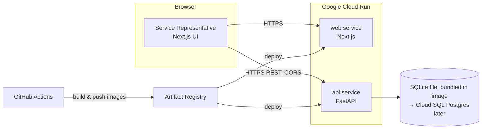
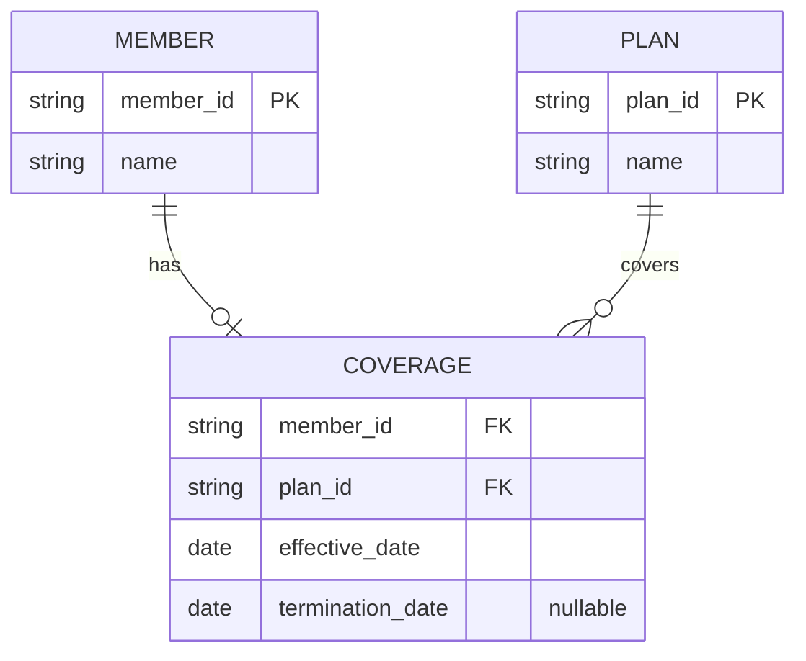

# WorkflowFox Showcase 3 — Technical Architecture

**Document:** Technical Architecture
**Version:** 0.1
**Status:** Draft for approval
**Derived from:** [plan.md](./plan.md) v0.1

## 1. Purpose

Define the technical architecture for the Member Eligibility showcase described in [plan.md](./plan.md). This document translates the product plan's functional requirements into a concrete, minimal system design.

**Design objective (per project direction):** demonstrate AI-assisted, end-to-end modern enterprise application engineering with minimal development time, deployment effort, and operating cost — not to demonstrate complex cloud infrastructure. Every component below exists because a requirement in plan.md justifies it; nothing is added speculatively.

## 2. Stack Summary

| Layer | Choice |
|---|---|
| Frontend | Next.js + React + TypeScript |
| Backend | Python + FastAPI |
| API style | REST, OpenAPI-documented (FastAPI native) |
| Database (initial) | SQLite, seeded with synthetic data, bundled in the backend image |
| Database (pre-release target) | PostgreSQL (Cloud SQL) |
| Containerization | Docker (one image per service) |
| CI/CD | GitHub Actions |
| Hosting | Google Cloud Run (two services) |

## 3. Architecture Overview

Two independently deployable services. No API gateway, no orchestration layer, no message queue, no microservice mesh — a browser talks to two HTTP services, one of which talks to a database file or instance.



The browser calls the FastAPI service directly for the eligibility check (simple CORS-enabled REST call), rather than proxying through the Next.js server. This keeps both services independently testable and avoids adding a backend-for-frontend layer that plan.md does not require. FastAPI's auto-generated interactive docs (`/docs`) are left publicly reachable — they double as a live demonstration of the REST/OpenAPI contract.

## 4. Components

### 4.1 Frontend — `web`

- Next.js (App Router) + React + TypeScript.
- Single page: member ID input, Check Coverage On date (defaults to today), submit, result panel, "start another inquiry" action.
- Statically rendered/client-rendered — no server-side data fetching of its own; all data comes from the `api` service at request time.
- Calls the backend's REST endpoint directly from the browser.

### 4.2 Backend — `api`

- FastAPI, single router exposing the eligibility endpoint (see §5).
- Pydantic models for request validation (non-empty member ID, valid ISO date) — satisfies plan.md's input-validation requirement at the framework level.
- SQLAlchemy as the data-access layer, specifically so the SQLite → PostgreSQL swap (§4.3) is a configuration change (connection string / engine), not a rewrite.
- OpenAPI schema generated automatically by FastAPI; this is the system's API contract of record.

### 4.3 Data

- **Initial:** SQLite file, seeded with synthetic members/plans/coverage at build time and bundled into the `api` container image. This is sufficient because plan.md states the showcase is read-only with synthetic data only — there is no write path and nothing that needs to persist across deployments.
- **Pre-release target:** PostgreSQL via Cloud SQL, same schema, same SQLAlchemy models. Migration is a config/deploy change (connection string, Cloud SQL instance, seed script run once) rather than an application redesign.
- No ORM migrations tooling (e.g. Alembic) is introduced unless/until the Postgres cutover actually happens — SQLite schema is created fresh from the same models on each image build.

Proposed schema (minimal, matches plan.md's single coverage segment per member):



## 5. API Design

Single resource, one read endpoint:

```
GET /api/v1/eligibility?memberId={string}&checkDate={ISO date}
```

**Response body** (mirrors plan.md §6 "Information Displayed"):

```json
{
  "memberId": "string",
  "memberName": "string | null",
  "planName": "string | null",
  "coverageEffectiveDate": "date | null",
  "coverageTerminationDate": "date | null",
  "checkCoverageOnDate": "date",
  "eligibilityStatus": "ELIGIBLE | NOT_YET_ELIGIBLE | INELIGIBLE | MEMBER_NOT_FOUND",
  "eligibilityReason": "string"
}
```

**Status code mapping:**

| Scenario (plan.md §12) | HTTP status | Body |
|---|---|---|
| Any of the four eligibility outcomes, including `MEMBER_NOT_FOUND` | `200` | Result object above — these are business outcomes, not errors |
| Blank member ID or invalid date | `422` | FastAPI/Pydantic validation error, mapped by the frontend to a friendly message |
| Unhandled backend failure | `500` | Generic error body with no internal detail exposed; frontend shows a friendly "temporarily unavailable, try again" message and allows retry |

Treating `MEMBER_NOT_FOUND` as a `200` business result (not a `404`) keeps the four eligibility outcomes symmetric, as plan.md defines them, and keeps frontend logic to a single response-shape branch rather than mixing HTTP-error handling with business-outcome handling.

## 6. Containerization

- `apps/web/Dockerfile` — multi-stage Next.js build, production image serves the built app.
- `apps/api/Dockerfile` — Python slim base, installs dependencies, copies app + seed SQLite data, runs via `uvicorn`.
- `docker-compose.yml` at the repo root for local development only (both services + shared network), not used in deployment — Cloud Run runs each image independently.

## 7. CI/CD — GitHub Actions

Two workflows, both triggered on push/PR to `main`:

1. **CI** — lint, type-check, unit tests for both `apps/web` and `apps/api`; build both Docker images to confirm they build cleanly. Runs on every PR.
2. **CD** (on merge to `main`) — build and tag both images, push to Google Artifact Registry, deploy both to Cloud Run via `gcloud run deploy`. Uses a GitHub Actions OIDC → Google Cloud Workload Identity Federation connection (no long-lived service-account key stored in GitHub).

No separate staging environment is introduced — out of scope per plan.md's emphasis on minimal operating cost; `main` deploys straight to the live demo.

## 8. Deployment — Google Cloud Run

- Two Cloud Run services: `member-eligibility-web`, `member-eligibility-api`.
- Both public (`allUsers` invoker) — no auth, per plan.md §9 "Production identity management ... out of scope."
- Both configured to scale to zero — idle cost is effectively $0, matching the "low operating cost" objective.
- `api` service CORS-restricted to the `web` service's origin.
- Region: single region, closest to the primary demo audience (to be confirmed — not yet decided, see §11).

## 9. Explicitly Out of Scope

Per plan.md's out-of-scope section and the stated objective for this showcase, the following are deliberately **not** introduced unless a future requirement justifies them:

- API gateway / BFF proxy layer
- Kubernetes or any container orchestrator beyond Cloud Run
- Message queues or async job processing
- Microservices beyond the two services above
- Terraform or other IaC tooling (deploy via `gcloud` CLI in GitHub Actions is sufficient at this scale)
- Authentication / authorization, SSO
- Multiple environments (staging/QA) beyond local + production
- Observability stack beyond Cloud Run's built-in logging/metrics

## 10. Error Handling & Reliability

Directly traceable to plan.md §12 acceptance scenarios:

- Invalid input (blank member ID, malformed date) → `422` from FastAPI validation → frontend renders a plain-language inline message, no resubmission of bad state required.
- Unknown member → `200` with `eligibilityStatus: MEMBER_NOT_FOUND` → frontend renders the not-found message, same visual pattern as other outcomes.
- Backend/database failure → `500`, generic body → frontend renders a generic "service temporarily unavailable" message with a retry action; no stack traces or internal errors are ever surfaced to the browser.

## 11. Deferred Decisions

Not yet decided — to be resolved during implementation planning, not blocking this architecture:

- Exact Cloud Run region.
- Whether the Postgres cutover happens before or after the first public demo.
- Synthetic data volume/variety (how many members, how many of each eligibility outcome) — a product/demo-content decision, not architectural.
- Whether `apps/web` and `apps/api` live in one repo (current) as a monorepo with shared CI, vs. split repos — current assumption is monorepo, matches this repository's existing structure.

## 12. Repository Layout (proposed)

```
member-eligibility-fullstack/
├── apps/
│   ├── web/           # Next.js + React + TypeScript
│   └── api/            # FastAPI + SQLAlchemy
├── docker-compose.yml  # local dev only
├── .github/workflows/
│   ├── ci.yml
│   └── cd.yml
└── _docs/
    ├── plan.md
    └── architecture.md
```

No code is created by this document — this defines the target layout for the implementation phase.
